```{r setup, include=FALSE}
knitr::opts_chunk$set(
  echo    = FALSE,      
  warning = FALSE,      
  message = FALSE,     
  fig.pos = "H",       
  out.width = "95%",
  fig.align = "center"
)

library(tidyverse)
library(knitr)
library(scales)

accidentes <- readRDS("Datos/Base de datos depurada/accidentes_bcn_2019_2025.rds")
```

<!--

-->

\newpage

# Introducción

 
Cada mañana recorro Barcelona en bicicleta para ir al trabajo y, como cualquier otra persona que use el mismo medio de transporte, tengo una idea intuitiva de qué tramos me resultan más incómodos y en qué cruces bajo la velocidad sin pensarlo. Este ha estado el punto de partida de mi trabajo: quería comprobar si los datos abiertos del Ajuntament de Barcelona podrían respaldar lo que creía saber o si realmente mi percepción del riesgo se parecía poco a las estadísticas registradas. Como podrán ver, los datos sí responden a algunas de mis preguntas, pero dejan otras abiertas. 

Según los datos publicados por el propio Ajuntament, Barcelona registra cada año alrededor de ocho mil accidentes de tráfico gestionados por la policía local. Las decisiones que se toman en materia de seguridad viaria como, dónde reducir la velocidad, dónde reforzar la vigilancia o qué cruces rediseñar, dependen de saber dónde, cuándo y qué consecuencias producen los siniestros. 

Para este trabajo he elegido el conjunto de datos abiertos que el Ajuntament de Barcelona publica cada año sobre los accidentes gestionados por la Guàrdia Urbana. Estos datos son adecuados para elaborar el proyecto porque (1) contiene variables numéricas y categóricas, serie temporal amplia y permite agrupar los datos por niveles territoriales, (2) son datos públicos, documentados y reutilizables bajo la licencia Creative Commons y (3) es un tema de relevancia actual, facilitando así poder imaginar una audiencia concreta que necesite consultar y visualizar los datos. 

El objetivo de la visualización es, por un lado mostrar cuántos accidentes ocurren y, por otro lado, ayudar a distinguir entre volumen y riesgo. Como se podrá ver en el análisis exploratorio, ambas dimensiones no coinciden. 


## Origen y contexto de los datos

Los datos proceden del portal Open Data BCN del Ajuntament de Barcelona,
concretamente del conjunto *Accidents gestionats per la Guàrdia Urbana a la
ciutat de Barcelona*, publicado bajo licencia Creative Commons Attribution 4.0.

```{r tabla-ficha}
tibble(
  Aspecto = c("Fuente", "Licencia", "Periodo", "Registros",
              "Unidad de análisis", "Frecuencia de actualización",
              "Cobertura geográfica"),
  Detalle = c("Open Data BCN — Ajuntament de Barcelona",
              "Creative Commons Attribution 4.0",
              "2019–2025 (siete ficheros anuales)",
              format(nrow(accidentes), big.mark = "."),
              "Un accidente registrado",
              "Anual",
              "Término municipal de Barcelona (10 distritos)")
) |>
  kable(caption = "Ficha técnica del conjunto de datos")
```

## Objetivos del proyecto

El proyecto parte de la siguiente pregunta: si en Barcelona se producen cada vez menos accidentes, significa esto que sus calles son más seguras? Para poder responder a esta pregunta se debe mirar no solo el número de siniestros sino también su gravedad, la distribución territorial y sus patrones temporales. 

El principal objetivo es analizar la evolución y la distribución de la siniestralidad vial gestionada por la Guàrdia Civil entre el año 2019 y el 2025 para determinar si la reducción del número de accidentes se ha acompañado por una reducción de su gravedad y qué zonas y momentos del día concentran el riesgo más alto. 

De este objetivo principal se derivan cinco objetivos específicos que guiarán el análisis exploratorio y el diseño de la visualización: 

(1) Describir la evolución temporal del número de accidentes y de su gravedad, distinguiendo el efecto de la pandemia de la tendencia de fondo posterior. 
(2) Comparar la siniestralidad entre los diez distritos de Barcelona, tanto en volumen absoluto como en proporción de accidentes graves, para poder detectar territorios con perfiles de riesgo distintos. 
(3) Observar los patrones temporales durante la semana, cruzando la hora del día con el día de la semana. 
(4) Localizar geográficamente puntos de mayor acumulación de accidentes graves. 
(5) Evaluar la calidad y las limitaciones del conjunto de datos, documentando cambios de criterio registro entre años y cómo ha afectado en la comparabilidad de la serie. 


\newpage

# Tarea 1. Análisis exploratorio de datos

Este apartado sigue una aproximación bottom-up: se parte de los datos disponibles para descubrir qué contienen y qué relaciones admiten ser representadas. Primero se describe cada campo del conjunto, después se examina la calidad de los datos y las incidencias detectadas durante la depuración y por último se exploran las distribuciones y las relaciones mediante una serie de gráficos. De estos gráficos se extraen los hallazgos que orientarán el diseño del dashboard. 

## Descripción de los campos

```{r tabla-variables}
tibble(
  Variable = names(accidentes),
  Tipo     = map_chr(accidentes, ~ class(.x)[1]),
  Valores  = map_int(accidentes, n_distinct),
  `% NA`   = round(100 * map_dbl(accidentes, ~ mean(is.na(.x))), 2)
) |>
  kable(caption = "Inventario de variables de la base depurada")
```

La base depurada contiene 29 variables, que se pueden agrupar en cuatro bloques según su función: 
(1) Identificación. El campo numero_expediente es una cadena de texto con formato 2019S000001 que identifica de forma única cada siniestro. Se conserva por trazabilidad, aunque realmente no interviene en el análisis. La variable fichero_origen se ha añadido durante la depuración para poder saber de qué fichero anual procede cada fila, que facilita ver incoherencias entre años. 

(2) Varialbes territoriales. El distrito nom_districte es una variable categórica nominal de diez niveles, sin ningún orden intrínseco. El barrio nom_barri es también una variable nominal, con 73 niveles y el nombre de la calle nom_carrer alcanza 6.031 valores distintos. Las coordenadas longitud y latitud son variables numéricas continuas y se expresan en grados decimales sobre el sistema WGS84, el estándar habitual el cartografia web. Su rango se limita aproximadamente entre 2,06 y 2,22 de longitud y entre 41,3 y 41,5 de latitud. 

(3) Variables temporales. El año nk_any y el mes mes_any, el día del mes dia_mes y la hora hora_dia son variables numéricas discretas. La hora además es una variable cíclica porque las 23h y las 0h son consecutivas aunque sus valores estén en extremos opuestos. Lo mismo ocurre con el mes. A partir de estos campos se ha construido la variable fecha, de tipo fecha, y que permite ordenar periodos. De esta variable se ha derivado dia_semana (categórica ordinal), fin_de_semana (categórica nominal binaria) y franja_horaria (categorica ordinal). El campo descripcio_torn distingue mañana, tarde y noche y es una variable ordinal. 

(4) Variable de consecuencias. Los recuentos de fallecidos, numero_morts, heridos leves, numero_lesionats_lleus y vehículos implicados, numero_vehicles_implicats son variables numéricas discreatas. Sus rangos son muy asimétricos, ya que los fallecidos por accidente solo toman los valores 0 y 1, mientras que los heridos leves llegan hasta 49 y los vehículos implicados hasta 18 en algún caso excepcional. 

De este último bloque se ha creado la variable gravedad, categórica ordinal de tres niveles (leve, grave y mortal). Esta variable no existía en los datos originales y se ha contruido durante la depuración a partir de los 3 campos de recuento de víctimas. Junto a ella se han 
creado total_lesionados, accidente_con_victimas y es_causa_vianant, las dos últimas de tipo lógico.


## Calidad y vigencia de los datos

Antes de unir los siete ficheros anuales, tuve que hacer una inspección y en este proceso pude descubrir 7 problemas de homogeneidad, recogidas en la sigueinte tabla. Estos problemas obligaron a tomar ciertas decisiones antes de poder analizar nada.


```{r tabla-incidencias}
tibble(
  Incidencia = c(
    "Cambios en los nombres de columna",
    "Columnas presentes solo en algunos años",
    "Los ceros se registran como celda vacía",
    "Valor -1 como código de dato no disponible",
    "Formato incompatible en Codi_barri",
    "Tipos mal inferidos en la lectura",
    "Espacios sobrantes en campos de texto"),
  `Años afectados` = c("Todos", "2019–2020", "2024–2025", "2019–2023",
                       "2020", "Todos", "Todos"),
  Tratamiento = c(
    "Renombrado y armonización",
    "Descartadas; variables recalculadas",
    "Imputados como 0 tras validar coherencia",
    "Convertido a valor faltante",
    "Campo descartado; se conserva el nombre de barrio",
    "Lectura forzada como texto",
    "Normalización con str_squish()")
) |>
  kable(caption = "Incidencias detectadas y tratamiento aplicado")
```

En los ficheros de 2024 y 2025 los valores cero se registran como celda vacía pero entre el 2019 y el 2023 se escribe un cero explícito. Concretamente, de los 7.741 accidentes de 2025, 7730 tienen el campo de fallecidos en blanco y solo 11 contienen un uno. Si estos blancos los interpretara como dato desconocido, el 97% de los accidentes recientes se quedarían sin clasificar y la serie temporal sería inservible. Este fue el problema más importante en los datos y la solución adoptada fue imputarlos como cero y se validó comprobando que el resultado, 11 accidentes mortales en 2025, es coherente con la serie histórica de la ciudad. 

Las otras seis incidencias se resolvieron de la siguiente manera. Los nombres de columna cambian entre años (las coordenadas pasan de Coordenada_UTM_X a Coordenada_UTM_X_ED50 a partir de 2021, y un campo llega con un espacio sobrante en su nombre), lo que se corrigió mediante renombrado. Dos columnas que existen solo en 2019 y 2020 se descartaron, ya que la información que aportaban, el día de la semana, podía recalcularse a partir de la fecha, opción más fiable. El valor -1, que la documentación identifica como dato no disponible, se convirtió en valor faltante para evitar 
que fuera tratado como un código territorial real. El campo Codi_barri se 
descartó porque en 2020 utiliza un formato compuesto del tipo 72-7-36 incompatible con el entero simple del resto de años. Se conserva en su lugar el nombre del barrio, homogéneo en los siete ficheros. Por último, se forzó la lectura de todas las columnas como texto, porque la inferencia 
automática de tipos corrompía el identificador de expediente y se normalizaron los espacios sobrantes de los campos de texto, que de otra manera habrían generado categorías duplicadas.

Después de la depuración, solo el 0,42 % de los registros carece de ubicación administrativa y el 0,08 % de coordenadas válidas. Estos porcentajes son bastante bajos como para no condicionar ningún resultado. El problema del conjunto de datos no es la ausencia de datos, sino la heterogeneidad de los criterios con que se han registrado.

Los datos se actualizan cada año: cada ejercicio se publica un fichero nuevo con los siniestros del año anterior. Esto claramente marca el uso que puede darse a la visualización. Su utilidad es la planificación estratégica: detectar tendencias, comparar territorios y decidir dónde intervenir. 

## Distribuciones y relaciones

### Evolución temporal

```{r fig-evolucion, fig.cap="Evolución mensual de los accidentes registrados"}
include_graphics("EDA/Graficos/01_evolucion_mensual.png")
```

La serie mensual muestra una discontinuidad evidente en marzo de 2020, cuando las restricciones de movilidad a causa de la pandemia redujeron los desplazamientos a mínimos. Ese año se registraron 6.268 accidentes, un 37,5 % menos que los 10.027 de 2019.

Lo relevante no es la caída sino lo que vino después: la serie se recupera parcialmente durante 2021 y 2022, pero se estabiliza en torno a los 7.700 siniestros anuales y no vuelve al nivel prepandemia. En 2025 se registraron 7.741 accidentes, un 22,8 % menos que seis años antes. Se trata de un cambio de nivel sostenido y no de una anomalía puntual, lo que sugiere una transformación duradera en los patrones de movilidad urbana.

```{r fig-volumen-gravedad, fig.cap="Número de accidentes frente a proporción de siniestros graves"}
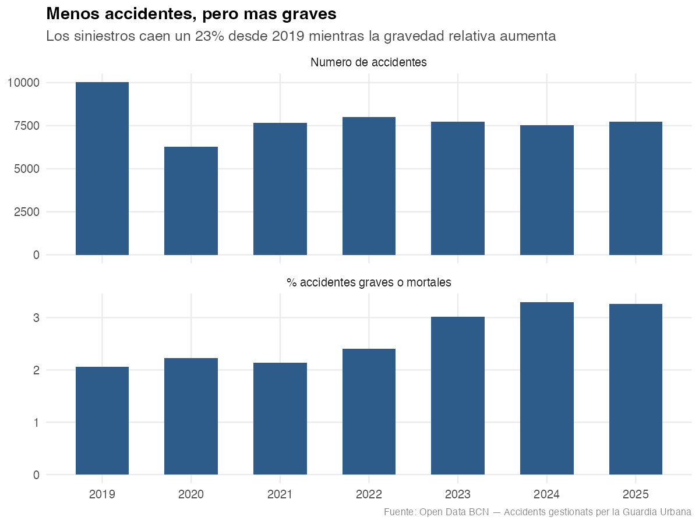
```

Este gráfico es posiblemente el hallazgo central del análisis. Si se mira solo el panel superior, la conclusión parecería inmediata, hay menos accidentes, entonces se podría asumiar que las calles son más seguras. Pero el panel inferior contradice esa lectura.

Mientras el volumen de siniestros desciende un 22,8 % entre 2019 y 2025, la proporción de accidentes graves o mortales aumenta del 2,06 % al 3,26 %, es decir, se multiplica por 1,6. En términos absolutos el contraste es aún más llamativo: los accidentes con heridos graves pasan de 185 en 2019 a 241 en 2025, un incremento del 30 % a pesar de producirse casi un tercio menos de 
siniestros. Los fallecidos, en cambio, siguen la dirección contraria y se reducen de 22 a 11.

Una hipótesis plausible de estos resultados podría ser un cambio en la composición del parque 
circulante, con mayor presencia de motocicletas y vehículos de movilidad personal, cuyos usuarios están más expuestos en caso de colisión que quienes viajan en un automóvil. Contrastarla supondría saber el tipo de vehículo implicado, información de la que no dispone este conjunto. Por esta razón este hallazgo es simplemente una asociación observada y no una relación causal establecida.


```{r fig-estacionalidad, fig.cap="Estacionalidad: media mensual de accidentes"}
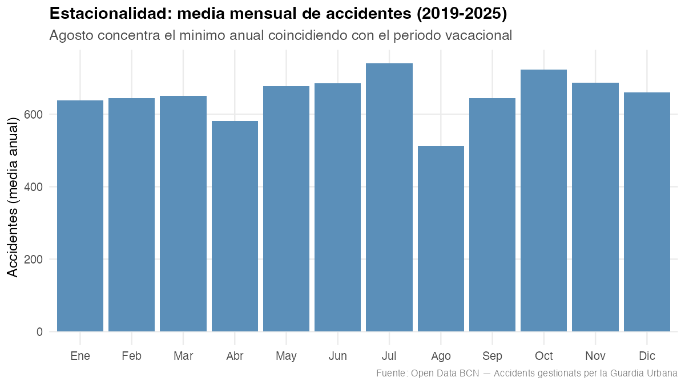
```

### Dimensión territorial

Los tres gráficos siguientes deben leerse juntos, porque cuentan una historia que ninguno de ellos revela por separado.

```{r fig-distrito-volumen, fig.cap="Volumen de accidentes por distrito"}
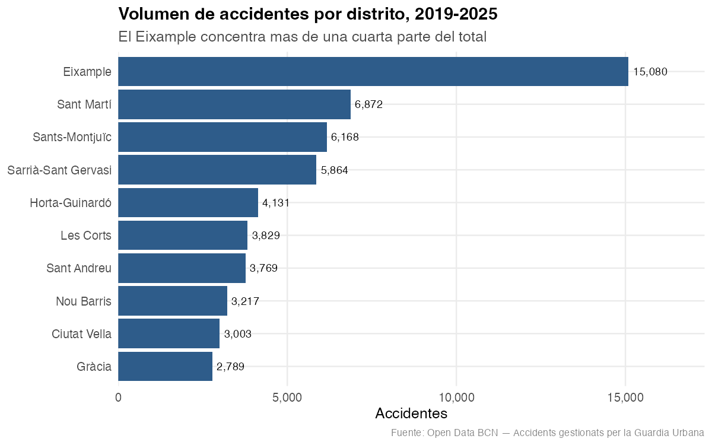
```

```{r fig-distrito-gravedad, fig.cap="Proporción de accidentes graves o mortales por distrito"}
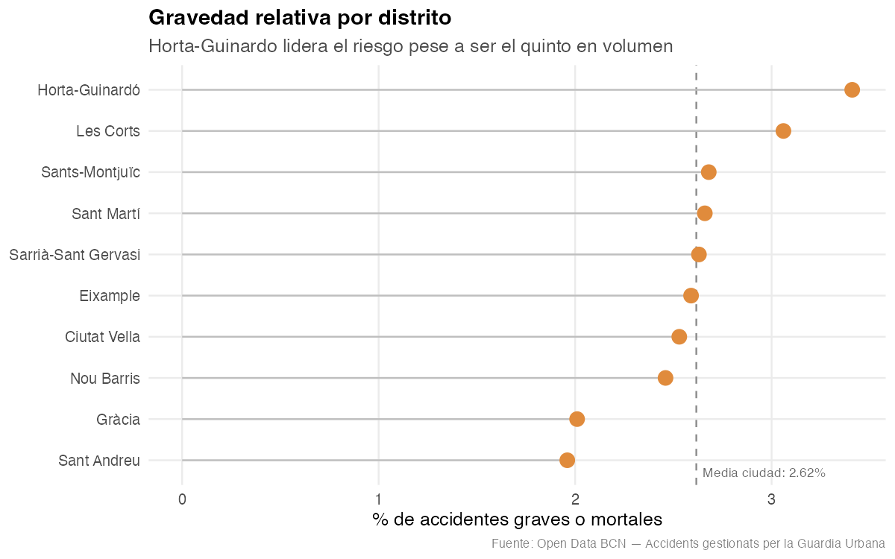
```

```{r fig-correlacion, fig.cap="Relación entre volumen de accidentes y gravedad relativa"}
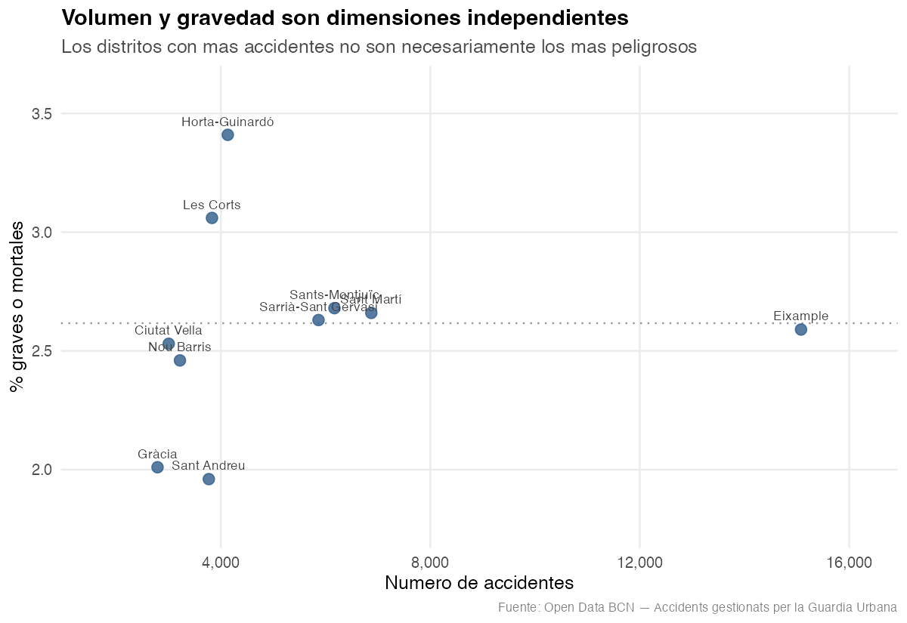
```

El primer gráfico muestra que el Eixample concentra 15.080 accidentes, más de una cuarta parte de los siniestros de toda la ciudad, muy por delante de Sant Martí (6.872) y Sants-Montjuïc (6.168). Es un resultado esperado ya que es el distrito más poblado, más denso y atravesado por los principales ejes viarios.

El segundo gráfico cambia por completo el retrato. Cuando se atiende a la proporción de accidentes graves o mortales, el Eixample cae a la zona media con un 2,59 %, prácticamente en la media municipal del 2,62 %. Quien encabeza el ranking es Horta-Guinardó, con un 3,41 %, siendo apenas el quinto distrito en volumen. Le sigue Les Corts con un 3,06 %. En el extremo opuesto, Sant Andreu presenta la tasa más baja de la ciudad (1,96 %), seguido de Gràcia (2,01 %).

El tercer gráfico confirma que no se trata de una casualidad: la correlación de Pearson entre el número de accidentes de un distrito y su gravedad relativa es de 0,097, prácticamente nula. Esto nos dice que volumen y riesgo son dimensiones independientes.

Sabiendo lo anterior, un panel que mostrara únicamente recuentos absolutos llevaría a concentrar todos los recursos en el Eixample y a ignorar por completo los distritos donde cada accidente tiene más probabilidades de acabar en una lesión grave. Este hallazgo es el que justifica que el dashboard debe representar ambas dimensiones y no solo el volumen.


### Patrones temporales

```{r fig-heatmap, fig.cap="Concentración de accidentes por hora y día de la semana"}
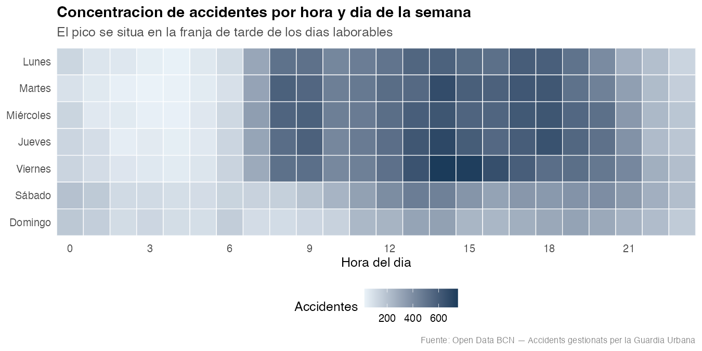
```

```{r fig-gravedad-dia, fig.cap="Desviación de la gravedad respecto a la media semanal"}
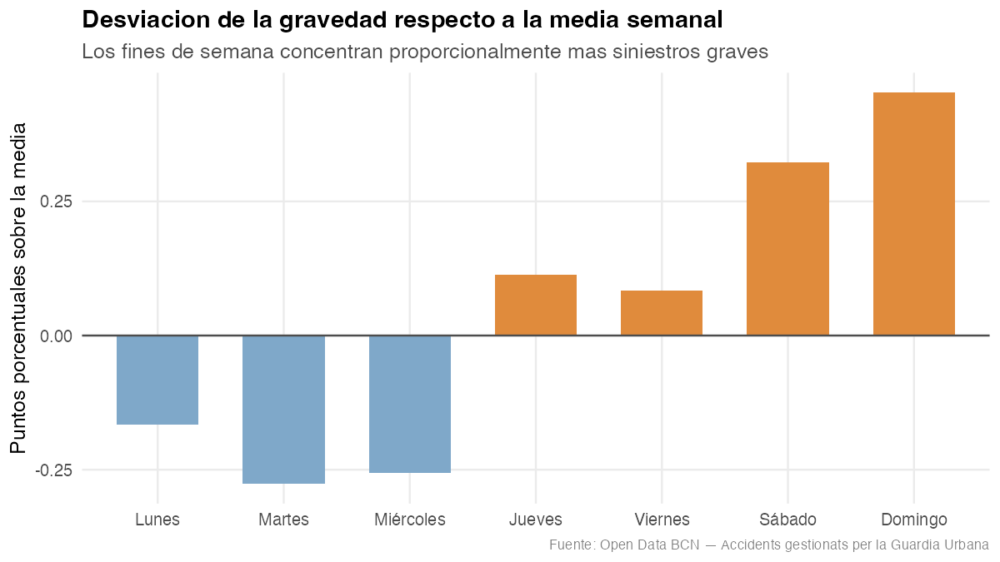
```

El mapa de calor revela que los accidentes se concentran en la franja laboral de los días de diario, con un máximo a las 14 h, seguido de las 13 h y las 18 h. Llama la atención que el pico principal no coincida con la hora punta matinal sino con la del mediodía, lo que probablemente refleja el patrón de desplazamientos característico de la ciudad. Las madrugadas quedan casi vacías salvo el fin de semana, donde se aprecia una banda de actividad nocturna ausente el resto de días.

El segundo gráfico introduce el mismo giro que ya apareció en el análisis territorial. El viernes es el día con más siniestros (9.179) y el domingo el que menos (4.828), con casi la mitad. Sin embargo, al medir la proporción de accidentes graves, el orden se invierte: el domingo encabeza la lista con un 3,07 % y el sábado le sigue con un 2,94 %, mientras el martes y el miércoles 
quedan por debajo del 2,4 %.

Que el mismo patrón inverso aparezca en dos dimensiones independientes, el territorio y el calendario, refuerza la interpretación. Una explicación razonable sería que la densidad de tráfico actúa como limitador de velocidad: donde circulan muchos vehículos se producen más colisiones, pero a menor velocidad y con consecuencias más leves; donde circulan pocos, los siniestros son menos frecuentes pero más severos. Es un fenómeno conocido en seguridad viaria, aunque estos datos permiten solo observarlo, no demostrarlo.

### Consecuencias y dimensión geográfica

```{r fig-vehiculos, fig.cap="Gravedad según el número de vehículos implicados"}
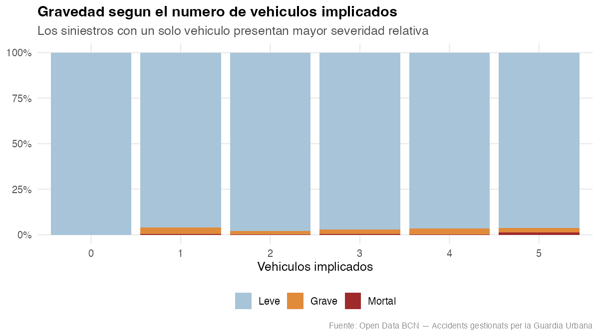
```

```{r fig-mapa, fig.cap="Localización de los accidentes graves y mortales"}
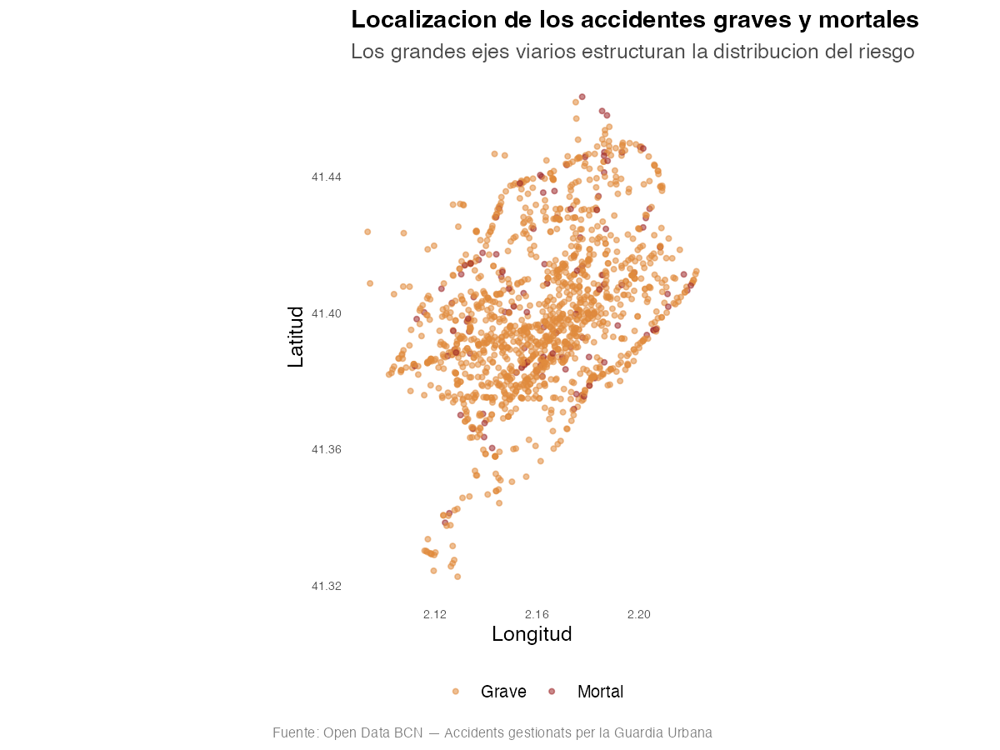
```

El gráfico de vehículos implicados muestra que la mayoría de los siniestros involucran a dos vehículos (36.808 casos), seguidos a distancia por los de un solo vehículo (13.615). Estos últimos, salidas de vía, atropellos, caídas, presentan una severidad relativa mayor, coherente con la interpretación anterior, son sucesos donde no hay una colisión que absorba energía.

Conviene añadir un dato que condiciona la lectura de todo el conjunto: el 90,3 % de los accidentes registrados tuvo al menos una víctima. El conjunto no es, por tanto, un censo de todos los accidentes de la ciudad, sino fundamentalmente de aquellos con daños personales o que requirieron intervención policial. En total, el periodo acumula 61.474 personas heridas leves, 1.418 graves y 115 fallecidas.

El mapa de puntos muestra que la distribución del riesgo no es aleatoria sino que se organiza siguiendo la trama viaria principal. Las vías con más siniestros registrados son la Gran Via de les Corts Catalanes (2.328), la Diagonal (1.958), el carrer d'Aragó (1.364) y la Meridiana (924): todas ellas grandes ejes de alta capacidad. Es coherente con lo observado hasta ahora, ya que son las carreteras donde se alcanzan las velocidades más altas dentro del entorno urbano.

Es importante mencionar que el mapa muestra solo los 1.438 accidentes graves y mortales, no los 54.954 del conjunto. Dibujar todos los puntos produciría una mancha que cubriría el plano entero sin aportar información. Filtrar por gravedad resuelve el problema técnico y también  alinea el gráfico con la pregunta que interesa responder, que es dónde se concentran los siniestros más severos.

## Selección de campos para la visualización final

El análisis exploratorio me permite decidir qué entra en el dashboard y qué se queda fuera.

Campos seleccionados. 
La visualización final incluirá  nueve variables: fecha, para la dimensión temporal; nom_districte, para la territorial; hora_dia y dia_semana, para los patrones intrasemanales; 
gravedad, como variable clave del proyecto; numero_morts y numero_lesionats_greus, para los indicadores de consecuencias; y longitud y latitud, para la representación cartográfica.

Relaciones que se destacarán. 
Cuatro, una por cada objetivo específico susceptible de representación gráfica: (1) la evolución temporal del volumen contrastada con la de la gravedad, (2) la comparación entre distritos en ambas dimensiones simultáneamente, (3) el cruce entre hora del día y día de la semana (4) y la distribución espacial de los siniestros graves.

Campos descartados. 
El número postal y el nombre de la vía se han excluido por resultar demasiado granulares para el nivel de decisión de la audiencia. Por ejemplo, un técnico que planifica actuaciones trabaja con distritos y ejes, no con portales concretos. La causa del peatón se descarta por su cobertura desigual entre años, que impediría comparaciones fiables. Las coordenadas UTM son redundantes respecto a longitud y latitud, y estas últimas son además el formato que necesitan las librerías de cartografía web. Por último, el número de vehículos implicados, aunque analíticamente interesante, no responde a ninguna de las preguntas planteadas por la audiencia y se ha dejado fuera para no sobrecargar el panel.

\newpage

# Tarea 2. Audiencia y objetivo

Este apartado adopta una aproximación top-down: se define primero para quién se diseña y 
qué necesita esa persona y solo después se decide cómo representarlo. 

Audiencia principal

La visualización se dirige a los técnicos del Departamento de Movilidad y de la Guàrdia Urbana del Ajuntament de Barcelona responsables de planificar actuaciones de seguridad viaria: dónde revisar la señalización, en qué franjas reforzar la vigilancia, etc. 

Su conocimiento de la materia es alto ya que conocen la ciudad, manejan la terminología de siniestralidad y no necesitan que se les explique qué distingue a un herido grave de uno leve. Esto permite prescindir de glosarios y notas aclaratorias que en otro contexto serían imprescindibles.

Su conocimiento de visualización de datos es medio. Trabajan habitualmente con informes y hojas de cálculo, pero no son analistas ni están familiarizados con representaciones poco convencionales. La consecuencia de diseño es directa: hay que emplear gráficos conocidos, líneas, barras o mapas y evitar codificaciones que requieran un aprendizaje previo. Con audiencias no expertas es importante priorizar la familiaridad sobre la sofisticación.

La plataforma de uso es el ordenador de escritorio en el puesto de trabajo. Esto permite un panel denso, con varios gráficos simultáneos e interacción mediante ratón, y no requiere un diseño adaptado a dispositivos móviles.

En cuanto al contexto y la periodicidad, se trata de un uso recurrente, mensual o trimestral, en reuniones de seguimiento y en la preparación de planes de actuación. No es una herramienta de consulta diaria. 

Audiencia secundaria

La visualización podría resultar útil a periodistas locales y entidades ciudadanas (asociaciones de vecinos, colectivos ciclistas) interesados en el estado de la seguridad viaria en su barrio. Su uso es puntual, su conocimiento técnico es menor y su objetivo suele reducirse a localizar una cifra concreta o comprender el panorama general.

Aunque no es la audiencia principal, su existencia justifica dos decisiones en el diseño. La primera, incluir cajas de valores con las magnitudes principales bien visibles, de modo que quien solo busca un dato lo encuentre sin interactuar. La segunda, redactar los títulos de los gráficos enunciando el hallazgo en lugar de limitarse a mencionar la variable representada: «menos accidentes, pero más graves» comunica más que «evolución anual de la siniestralidad».

## Preguntas que debe resolver la visualización

```{r tabla-preguntas}
tibble(
  `Nº` = 1:6,
  Pregunta = c(
    "¿Ha disminuido la siniestralidad desde 2019, o solo cambió con la pandemia?",
    "¿La caída de accidentes se ha traducido en menos víctimas graves?",
    "¿Qué distritos concentran más accidentes y cuáles son proporcionalmente más peligrosos?",
    "¿En qué franjas horarias y días conviene reforzar la vigilancia?",
    "¿Dónde se localizan los puntos negros de accidentes graves?",
    "¿Los patrones de riesgo son iguales en todos los distritos?"),
  Objetivo = c("1", "1", "2", "3", "4", "2 y 3")
) |>
  kable(caption = "Preguntas de la audiencia y objetivo con el que se corresponden")
```

Las seis preguntas de la tabla corresponden con un objetivo específico y con un elemento concreto del dashboard, de manera que ningún gráfico ocupa espacio sin responder a una necesidad identificada.

Las dos primeras abordan la dimensión temporal y están deliberadamente separadas. Preguntar si ha disminuido la siniestralidad y preguntar si hay menos víctimas graves parecen la misma cuestión, pero el análisis exploratorio ha demostrado que sus respuestas divergen. Formularlas por separado obliga al panel a mostrar ambas magnitudes.

La tercera y la cuarta preguntan se centran en dónde intervenir y cuándo. Son las preguntas que un técnico de movilidad necesita responder para justificar una propuesta de actuación.

La quinta se va al nivel de detalle máximo que permiten los datos, la localización concreta del siniestro y es la que justifica la inclusión de un mapa interactivo en lugar de una simple tabla por distritos.

La sexta es la que justifica la interacción. Si todas las preguntas fueran de alcance municipal, un panel estático bastaría. Al preguntar si los patrones de riesgo son iguales en todos los distritos, se hace necesario que el usuario pueda filtrar y comparar y que ese filtro se propague a todos los gráficos simultáneamente.

Preguntas que se quedan fuera del alcance

Tres cuestiones quedan fuera:

- ¿Ha aumentado el riesgo para ciclistas o usuarios de vehículos de movilidad personal? El fichero principal no recoge el tipo de vehículo implicado, de modo que la pregunta, que probablemente la más interesante desde el punto de vista de la política de movilidad actual, no tiene respuesta con estos datos.
- ¿Qué distrito es objetivamente más peligroso? Requeriría normalizar por intensidad de tráfico o por desplazamientos, información no disponible.
- ¿Han funcionado las medidas adoptadas en un punto concreto? Exigiría conocer la fecha de implantación de cada actuación, que se desconoce en este conjunto.


\newpage

# Tarea 3. Selección de gráficos y codificación

Este apartado completa la aproximación top-down iniciada en la tarea anterior. Para cada pregunta de la audiencia, identificar primero cuál es la función comunicativa que debe cumplir el gráfico, evolución, ranking, distribución, magnitud, espacial y derivar de ahí el tipo de representación.

Cada decisión se sustenta en tres criterios: (1) la función que debe cumplir el elemento, (2) el tipo de dato que codifica y (3) el principio de percepción visual en que se apoya. A continuación se desarrolla cada uno de los cinco elementos seleccionados.

```{r tabla-graficos}
tibble(
  Elemento = c("Cajas de valores", "Serie temporal", "Ranking de distritos",
               "Mapa de calor", "Mapa de puntos"),
  Función = c("Magnitud", "Evolución temporal", "Ranking",
              "Distribución", "Espacial"),
  `Codificación principal` = c("Tamaño del texto", "Posición vertical",
                               "Posición horizontal", "Saturación",
                               "Posición en 2D"),
  `Principio perceptivo` = c("Enclosure", "Continuidad", "Continuidad y punto focal",
                             "Intensidad preatentiva", "Posición y color"),
  Pregunta = c("1 y 2", "1 y 2", "3", "4", "5")
) |>
  kable(caption = "Elementos del dashboard y justificación de su selección")
```

Cajas de valores

Su función es comunicar magnitud: cuántos accidentes, cuántos heridos graves, cuántos fallecidos y qué proporción representan los siniestros severos.

La codificación elegida es simplemente texto numérico de gran tamaño, sin ningún elemento gráfico. El tamaño de la tipografía establece la jerarquía visual, situando estos cuatro valores en el nivel superior de atención y el recuadro que los contiene actúa como enclosure de la Gestalt.

Serie temporal

Su función es mostrar la evolución temporal, respondiendo a las preguntas 1 y 2.

Se ha optado por un gráfico de líneas: el eje horizontal representa el tiempo, una variable continua ordenada y el vertical el número de accidentes, una variable numérica discreta en escala de razón. La magnitud se codifica mediante la posición vertical, que es la codificación perceptivamente más precisa de las disponibles según la jerarquía establecida por Cleveland y 
McGill (1984). La línea que une los puntos aprovecha la ley Gestalt de continuidad: el ojo recorre la trayectoria sin esfuerzo consciente.

El eje vertical comienza en cero. En un gráfico de líneas esta decisión es discutible, ya que truncar el eje permite apreciar mejor las variaciones pequeñas. Se ha mantenido el cero porque el mensaje que interesa transmitir es precisamente la magnitud de la caída de 2020, y truncar el eje la exageraría.

Ranking de distritos

Su función es el ranking, respondiendo a la pregunta 3.

Se ha elegido un gráfico de tipo lollipop: un punto por distrito unido al eje mediante una línea fina. Los distritos se sitúan en el eje vertical como variable categórica nominal, ordenados por valor y el porcentaje de accidentes grave se codifica mediante la posición horizontal.

La ordenación por valor explota de nuevo la ley de continuidad, permitiendo recorrer el ranking de un vistazo. Y la línea discontinua que marca la media municipal actúa como punto focal: al introducir una referencia, convierte la lectura de una simple comparación entre distritos en una comparación por desviación, mucho más informativa. Esta línea va explícitamente etiquetada.

Mapa de calor de hora y día

Su función es mostrar la distribución sobre dos dimensiones categóricas simultáneas, respondiendo a la pregunta 4.

Las dos variables categóricas, hora del día y día de la semana, se sitúan en los ejes, y la frecuencia se codifica mediante la saturación del color con una escala secuencial monocroma. La elección responde a la naturaleza del dato: se trata de un valor numérico ordenado, de modo que el color debe variar en intensidad y no en tono, ya que un cambio de tono sugeriría categorías 
distintas en lugar de más o menos cantidad.

El fundamento perceptivo es que la intensidad es una propiedad preatentiva: las zonas de mayor concentración se detectan en menos de 250 milisegundos, sin necesidad de recorrer la cuadrícula celda por celda. 

Existe una limitación que conviene remarcar: el color permite comparar magnitudes con bastante menos precisión que la posición. Se acepta el compromiso porque el objetivo de este gráfico es detectar el patrón, no leer valores exactos, y esos valores se ofrecen igualmente mediante tooltip al situar el cursor sobre cada celda.

Mapa de puntos

Su función es espacial, respondiendo a la pregunta 5.

Se ha optado por un mapa de símbolos y no por un mapa coroplético ya que aquí interesa la posición exacta de cada siniestro. Usar un mapa coroplético introduciría un sesgo claro: distritos de superficie muy distinta ocuparían áreas visuales muy distintas y esto haría parecer más importantes los territorios más extensos con independencia de sus cifras.

La codificación principal es la posición en dos dimensiones sobre coordenadas geográficas reales, complementada por el color para distinguir la gravedad. La transparencia parcial de los símbolos mitiga el solapamiento en las zonas de mayor concentración.

Elementos descartados

Se han descartado otros gráficos como el gráfico de estacionalidad mensual. Este aunque revela un patrón claro, no responde a ninguna de las seis preguntas planteadas. El de vehículos implicados es analíticamente interesante pero también secundario respecto a los objetivos. Y el diagrama de dispersión que cruza volumen y gravedad por distrito, tiene uno de los hallazgos centrales, pero implica leer dos ejes simultáneamente y se ha considerado que supone una carga cognitiva importante para un panel de consulta rápida y se ha dejado para este informe, no el dashboard.
⸻

## Codificación del color

```{r tabla-color}
tibble(
  Variable = c("Gravedad", "Frecuencia (mapa de calor)",
               "Desviación sobre la media"),
  `Tipo de dato` = c("Categórica ordinal", "Numérica continua",
                     "Numérica con punto neutro"),
  Escala = c("Secuencial (azul claro → naranja → rojo oscuro)",
             "Secuencial monocroma",
             "Divergente (azul ↔ naranja)"),
  Justificación = c(
    "El orden del dato exige orden en el color",
    "Un solo tono variando en saturación permite percibir magnitud",
    "Tiene un cero significativo con dos direcciones")
) |>
  kable(caption = "Escalas de color según el tipo de dato")
```

A las escalas recogidas en la tabla anterior conviene añadir dos consideraciones sobre accesibilidad, ya que un porcentaje de la población presenta alguna forma de dicromatismo.

La primera es la elección de la paleta. Se ha utilizado una combinación de azul y naranja en lugar del clásico contraste rojo-verde, porque esta última resulta indistinguible para quienes tienen deuteranopia o protanopia, las dos formas más frecuentes de daltonismo. La paleta azul-naranja mantiene su contraste bajo ambas condiciones.

La segunda, y más importante, es que el color nunca es el único canal de codificación. La gravedad se acompaña siempre de la posición y de una etiqueta textual. Las cifras clave aparecen escritas en las cajas de valores y los gráficos incluyen leyendas. Ningún mensaje del dashboard 
depende solo de la capacidad del usuario para distinguir dos tonos. Es la recomendación habitual en la literatura sobre visualización accesible y el trabajo de Cynthia Brewer sobre el uso del color en cartografía es una referencia clásica en esta materia.

## Escalas y unidades

Las escalas que se han usado en cada elemento son las siguientes:

Eje temporal. El mes constituye la unidad mínima de agregación en la serie temporal. Se ha descartado el día por producir una serie ruidosa con menos de treinta accidentes diarios, la variación aleatoria oculta la tendencia y se ha descartado el año por resultar demasiado grueso para apreciar el efecto del confinamiento. Las etiquetas del eje se muestran por años para no saturar la escala.

Recuentos. Los números de accidentes, heridos y fallecidos son enteros medidos en escala de razón. En todos los gráficos de magnitud el eje comienza en cero. La razón es que en un gráfico de barras el lector compara longitudes y truncar el eje distorsiona la proporción entre ellas.

Porcentajes de gravedad. Se presentan con dos decimales. Las diferencias entre distritos se mueven en el rango de una o dos décimas, de modo que redondear a números enteros haría desaparecer distinciones reales. En los textos y titulares se emplea un solo decimal por 
legibilidad.

Coordenadas geográficas. Se expresan en grados decimales sobre el sistema WGS84, el estándar de las librerías cartográficas web. Se han descartado las coordenadas UTM que ya existían en el original porque son menos manejables.

Unidad de análisis. En todo el trabajo, cada registro equivale a un accidente, no a una víctima ni a un vehículo. Es una precisión necesaria: un mismo siniestro puede haber causado varias personas heridas, de modo que el número de accidentes y el número de víctimas no son intercambiables.

\newpage

# Tarea 4. Disposición e interacción

Disposición de los elementos

El dashboard se organiza en una rejilla de tres bandas horizontales, con una barra lateral izquierda reservada a los controles. La banda superior contiene las cuatro cajas de valores: la intermedia, la serie temporal y el ranking de distritos y la inferior, el mapa de calor y el mapa de puntos.

Esta disposición responde a los principios de organización perceptiva de la Gestalt.

La idea es que se lean como un bloque unitario de contexto general y no como cuatro elementos independientes.

El enclosure actúa en cada gráfico, contenido en su propio recuadro con borde. El contenedor común agrupa título, gráfico y leyenda como una unidad, evitando que el lector dude sobre a qué gráfico pertenece cada leyenda.

La relación figura-fondo se establece mediante un fondo general neutro y claro sobre el que las cajas blancas de los gráficos destacan ligeramente. Los datos constituyen la figura y todo lo demás retrocede.

La región común, situada fuera del área de gráficos y sobre un fondo diferenciado, se comunica sin necesidad de explicación que actúan sobre el conjunto del panel y no sobre un elemento concreto.

Por último, el orden de lectura sigue el recorrido en Z habitual en culturas de escritura occidental, situando arriba a la izquierda lo más importante y abajo a la derecha el detalle.

Los elementos se ordenan de lo general a lo específico siguiendo la secuencia cuánto → cuándo → dónde → a qué hora → en qué punto exacto. El panel propone un recorrido que va del panorama municipal al cruce concreto.

Interacción

El dashboard implementa seis mecanismos de interacción, cada uno corresponde a un modelo distinto.

El selector de periodo, un deslizador que acota el rango de años, es un mecanismo de filtrado. Responde a la pregunta 1, permitiendo aislar el año 2020 para observar el efecto del confinamiento o excluirlo para valorar la tendencia de fondo sin esa anomalía.

El selector de distrito combina filtrado con vistas vinculadas y constituye el núcleo interactivo del panel: cuando se elige un distrito, los cuatro indicadores, la serie temporal, el mapa de calor y el mapa se recalculan simultáneamente. Es lo que responde a la pregunta 6 y lo que convierte el dashboard en una herramienta de exploración en lugar de un póster estático.

Las casillas de gravedad permiten mostrar u ocultar cada nivel de severidad. Su utilidad se deriva del análisis exploratorio: dado que el 97,4 % de los accidentes son leves, las categorías 
graves quedan sepultadas en cualquier representación conjunta, y poder aislarlas resulta imprescindible.

Los tooltips aplican el modelo de detalles bajo demanda. Resuelven la limitación de precisión del mapa de calor sin saturar la vista con etiquetas numéricas permanentes.

El zoom y el desplazamiento del mapa combinan zoom óptico y pan, permitiendo descender desde la vista municipal hasta un cruce concreto, que es lo que pide la pregunta 5.

El selector de capa base del mapa aplica el modelo de capas, permitiendo alternar entre un fondo cartográfico simplificado y un callejero detallado según el nivel de contexto que el usuario necesite.

Una decisión de diseño corregida

Durante la construcción del prototipo detecté y que ilustras que las vistas vinculadas no deben aplicarse de forma automática a todos los elementos.

En el diseño inicial, el indicador de gravedad relativa respondía a todos los filtros, incluido el de gravedad. La consecuencia era que, al desmarcar la categoría «leve», el indicador mostraba un 100 %. Técnicamente era correcto, ya que el 100 % de lo mostrado era efectivamente grave o mortal, pero susceptible a leerse como si el 100 % de los accidentes de Barcelona fueran graves.

La solución adoptada fue desvincular ese indicador del filtro de gravedad, manteniéndolo siempre referido al conjunto. 

Por la misma razón, el ranking de distritos ignora el filtro de distrito. Si no lo ignorase, seleccionar un distrito dejaría el gráfico con un único punto y se perdería la comparación que 
justifica su existencia. En su lugar, el distrito seleccionado se resalta en un color distinto dentro del ranking completo.

El coste cognitivo de la interacción

La interacción es la gran aportación del medio digital, pero no es gratuita: cada control que se añade exige del usuario una decisión y una carga de memoria. Se han adoptado cinco medidas para mitigar ese coste.

Todos los filtros se concentran en un único lugar, nunca dispersos junto a los gráficos que afectan. El estado inicial del panel responde a la pregunta principal sin necesidad de tocar nada, de modo que un usuario que solo quiera el panorama general no tiene que interactuar. Los controles siguen convenciones estándar, deslizador para el tiempo, desplegable para categorías, 
casillas para selección múltiple, evitando cualquier mecanismo que requiera aprendizaje. El título de cada gráfico refleja el filtro activo, proporcionando retroalimentación inmediata sobre qué subconjunto se está viendo. Y un botón de reinicio permite volver al estado inicial sin 
desorientarse.

Se ha descartado la navegación jerárquica hasta el nivel de barrio (drill down). Sería viable, pero añadiría un nivel de navegación que la audiencia no necesita.

\newpage

# Tarea 5. Bocetos iniciales

Antes de construir el dashboard se elaboraron varios bocetos para probar diferentes alternativas. 

```{r boceto1, fig.cap="Primer boceto: propuesta inicial descartada"}
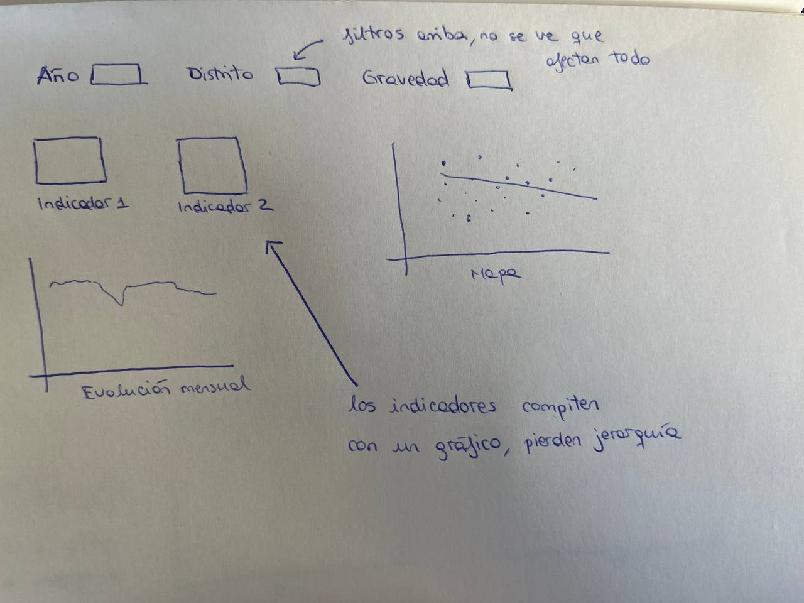
```

La primera propuesta situaba los tres filtros en una barra horizontal superior, seguidos de dos indicadores numéricos y dos gráficos, la serie temporal y el mapa,  repartidos sin una estructura clara. Al revisarla observé varios problemas, anotados sobre el propio dibujo.

El primero afecta a los filtros: colocados en una franja superior, en línea con el resto del contenido, no comunican que actúan sobre todos los elementos del panel. El lector podría interpretarlos como una cabecera informativa o como controles asociados únicamente al gráfico que tienen debajo.

El segundo afecta a los indicadores: al situarlos en la misma zona que la serie temporal, compiten con ella por la atención y pierden la jerarquía que les corresponde. Su función es ofrecer el contexto general antes que cualquier otra cosa, y para eso necesitan un espacio propio.

El tercero es de alcance: con solo dos indicadores y dos gráficos, la propuesta dejaba sin cubrir las preguntas 3 y 4, relativas a la comparación entre distritos y a los patrones horarios.


```{r boceto2, fig.cap="Segundo boceto: propuesta adoptada, anotada con las preguntas que resuelve cada elemento"}
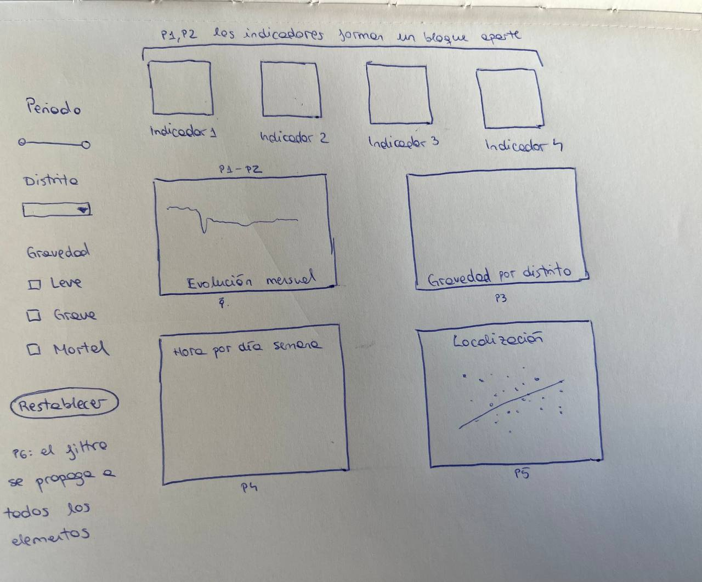
```

La segunda propuesta corrige los tres problemas anteriores.

Los filtros se trasladan a una barra lateral izquierda, separada visualmente del área de gráficos. Ese aislamiento comunica sin necesidad de explicación que los controles operan sobre el conjunto del panel. Se añade además un botón de restablecimiento, que permite volver al estado inicial sin desorientarse.

Los cuatro indicadores ocupan ahora una banda propia en la parte superior, alineados y agrupados por proximidad. Al no compartir espacio con ningún gráfico, recuperan el nivel superior de la jerarquía visual. 

Los cuatro gráficos se organizan en dos filas de dos, siguiendo la progresión de lo general a lo específico: primero cuándo y dónde, después a qué hora y en qué punto exacto.

Correspondencia con las preguntas planteadas
El segundo boceto está anotado con las referencias a las preguntas de la Tarea 2, de modo que puede comprobarse directamente sobre el dibujo que ninguna queda sin respuesta
.
Los cuatro indicadores responden a las preguntas 1 y 2 en su nivel más inmediato, ofreciendo las magnitudes principales sin necesidad de interactuar. La serie temporal desarrolla esas mismas preguntas mostrando la evolución. El gráfico de gravedad por distrito responde a la pregunta 3, el de hora por día de la semana, a la 4 y el mapa de localización, a la 5.

La pregunta 6 es la única que ningún gráfico resuelve por sí solo. Se responde mediante el selector de distrito de la barra lateral: al propagarse a todos los elementos del panel, permite comprobar si los patrones observados en el conjunto de la ciudad se reproducen en cada territorio. 


\newpage

# Conclusiones

El análisis exploratorio ha permitido responder a la pregunta que motivaba el proyecto, y la respuesta resulta menos tranquilizadora de lo que sugerían las cifras globales. Entre 2019 y 2025 la siniestralidad vial en Barcelona descendió un 22,8 %, sin recuperar el nivel prepandemia, pero ese descenso no se tradujo en una reducción equivalente de sus consecuencias: la proporción de 
accidentes graves o mortales pasó del 2,06 % al 3,26 %, y el número absoluto de siniestros con heridos graves aumentó de 185 a 241. Los fallecidos, en cambio, se redujeron a la mitad.

El segundo hallazgo relevante es que volumen y riesgo constituyen dimensiones independientes. La correlación entre el número de accidentes de un distrito y su gravedad relativa es prácticamente nula, de modo que los territorios con más siniestros no son necesariamente aquellos donde cada siniestro resulta más peligroso. El mismo patrón inverso aparece en la dimensión temporal, donde los días de menor tráfico concentran proporcionalmente más accidentes graves. Que dos dimensiones independientes muestren la misma relación refuerza la interpretación de fondo.

Estos resultados han condicionado directamente el diseño propuesto. Un dashboard que mostrara únicamente recuentos absolutos ocultaría el hallazgo principal, de modo que la visualización representa siempre ambas dimensiones en paralelo: el volumen y la gravedad relativa. La disposición de los elementos sigue una progresión de lo general a lo específico y la interacción permite comprobar si los patrones municipales se reproducen en cada territorio, que es la pregunta que ningún gráfico estático puede responder.

El proceso ha mostrado también que las aproximaciones bottom-up y top-down se necesitan mutuamente. Sin el análisis exploratorio previo, el diseño habría partido de la premisa equivocada de que menos accidentes equivale a más seguridad. Sin haber definido antes la audiencia y sus preguntas, el panel se habría llenado de gráficos interesantes pero inútiles para quien debe tomar decisiones.

# Limitaciones

Los datos empleados presentan tres limitaciones importantes.

(1) El conjunto recoge únicamente los accidentes gestionados por la Guàrdia Urbana, de modo que no incluye los siniestros no reportados. Dado que el 90,3 % de los registros presenta al menos una víctima, se puede deducir que los accidentes con daños exclusivamente materiales están infrarrepresentados.

(2) Al no disponerse de datos sobre intensidad de tráfico ni sobre volumen de desplazamientos, no es posible calcular tasas de riesgo por vehículo-kilómetro. Todas las cifras se refieren a accidentes registrados, no a riesgo por desplazamiento. La consecuencia práctica es que la comparación entre distritos refleja simultáneamente el riesgo y la exposición: un territorio puede presentar pocos accidentes simplemente porque circulan pocos vehículos por él. Sin esta advertencia, el ranking de distritos podría leerse erróneamente como un ranking de peligrosidad.

(3) Los cambios de criterio de registro documentados entre años obligan a interpretar con cautela cualquier comparación que abarque el periodo completo. Aunque la depuración ha armonizado los ficheros, no puede descartarse que existan otros cambios metodológicos no documentados que afecten a la comparabilidad.

A las tres limitaciones anteriores se añade la falta de información sobre el tipo de vehículo implicado, probablemente la variable más valiosa que podría incorporarse a una futura edición del conjunto. Su falta tiene una consecuencia muy concreta: la pregunta que motivó inicialmente este trabajo, si desplazarse en bicicleta por Barcelona se ha vuelto más o menos seguro en los últimos años, es precisamente una de las que estos datos no permiten responder. 

Sin saber qué vehículos intervinieron en cada siniestro, no hay forma de distinguir un alcance entre dos turismos de un atropello a un ciclista y el aumento de la gravedad que documenta este informe podría deberse a causas muy distintas. Este análisis describe dónde y cuándo se producen los siniestros, no quién los sufre ni por qué.

\newpage

# Referencias


Ajuntament de Barcelona. (2026). *Accidents gestionats per la Guàrdia Urbana a
la ciutat de Barcelona* [Conjunto de datos]. Open Data BCN.
https://opendata-ajuntament.barcelona.cat/data/ca/dataset/accidents-gu-bcn

Brewer, C. A., & Harrower, M. (s. f.). ColorBrewer 2.0: Color advice for cartography. https://colorbrewer2.org

Ribera, M. (2026). Visualización de datos [Materiales docentes]. Módulo 8, Máster en Behavioral Data Science. Universitat de Barcelona.

Leiva, D. (2026). Investigación reproducible [Materiales docentes]. Módulo 8, Máster en Behavioral Data Science.Universitat de Barcelona.

Wickham, H., & Grolemund, G. (2017). R for data science. O'Reilly. https://r4ds.had.co.nz
